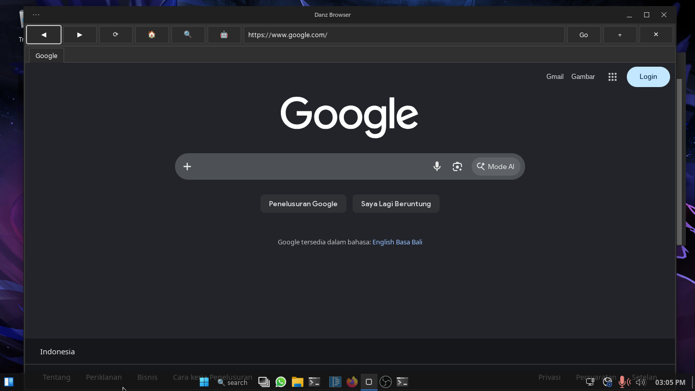

# 🌐 Danz Browser

A lightweight Linux browser built with **GJS + GTK3 + WebKitGTK 4.1**.

Designed to be simple, fast, and portable with AppImage support.

## ✨ Features

- 🚀 Lightweight WebKitGTK engine
- 🗂️ Multi-tab browsing
- 🔒 Persistent browser profile
- 🍪 Cookie storage
- 🌙 Dark theme support
- 📦 Portable AppImage
- 🐧 Linux friendly

## 📸 Screenshot



## 📥 Download

You can download the latest release of **Danz Browser** here:

**⬇️ Google Drive**
https://drive.google.com/file/d/1qeuULHPhW39DatZXp16_SF_P--T3Zwvi/view?usp=sharing


## ❤️ Support

If you enjoy using **Danz Browser** and would like to support its development, you can contribute through:

* 💙 PayPal: https://paypal.me/gumilangstore
* 🧡 Sociabuzz: https://sociabuzz.com/agumrp/tribe

Every contribution helps improve the project and supports future updates. Thank you for your support! 🚀

---

## 📺 Subscribe on YouTube

If you like this project, don't forget to subscribe to my YouTube channel for development updates, tutorials, and future projects.

**🔗 https://www.youtube.com/@agumrp**

⭐ If this project helps you, please consider giving this repository a **Star** on GitHub and sharing it with others!


### Run

```bash
chmod +x Danz_Browser-x86_64.AppImage
./Danz_Browser-x86_64.AppImage
```

> **Note:** Danz Browser is distributed as an **AppImage**, so no installation is required. Simply make it executable and run it.


